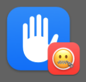
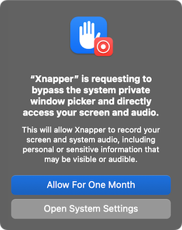

# macOS 15 screencapture nag remover

## Abstract

macOS 15 (Sequoia) introduced a new "security" feature which has frustrated many people, and insulted power users who prefer to have full control over their systems. The effect is nagging popups like the one below when apps that you have already granted permission to try to record your screen.

<figure>
  
  <figcaption style="font: italic bold 12px sans-serif;">Hey Apple, you forgot the “Always Allow” option!</figcaption>
</figure>

## How to use

Download the latest release and place the script in your `$PATH` (I suggest `/usr/local/bin` if you're unsure).

Then simply run the command with no arguments. It will iterate over any apps which have requested screencapture permissions and set the nag date for each to 100 years in the future. That _should_ prevent you from seeing the nag again.

> **N.B.** _If [life expectancy][1] increases dramatically over the next few years, you might need to run the app again in a decade or two._ 😉

There are a couple of commandline arguments:

- `-r` will reveal the .plist responsible for these nags in Finder
- `-p` will print the **current** values without making any changes
- `-a <path>` will create a new entry in the plist for an app that you specify.

Example of manually adding an app:

```
screencapture-nag-remover.sh -a "/Applications/CleanShot X.app/Contents/MacOS/CleanShot X"
```

If you encounter any problems, please file an [issue][3]. And in case anyone [@Apple][2] is reading this, please get rid of this bothersome "feature"...


[1]: https://data.worldbank.org/indicator/SP.DYN.LE00.IN
[2]: https://github.com/apple
[3]: https://github.com/luckman212/screencapture-nag-remover/issues
[4]: https://github.com/luckman212/screencapture-nag-remover/releases
